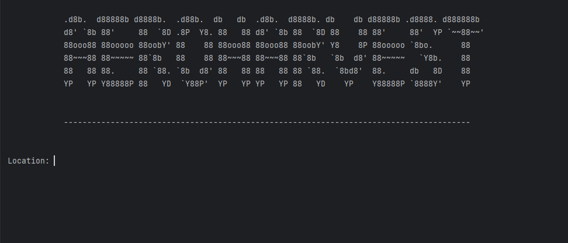
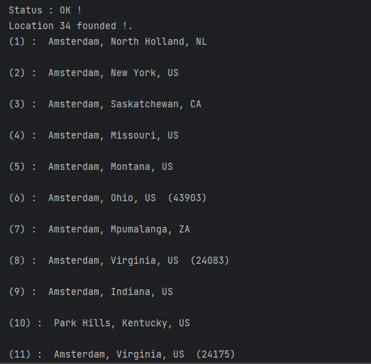
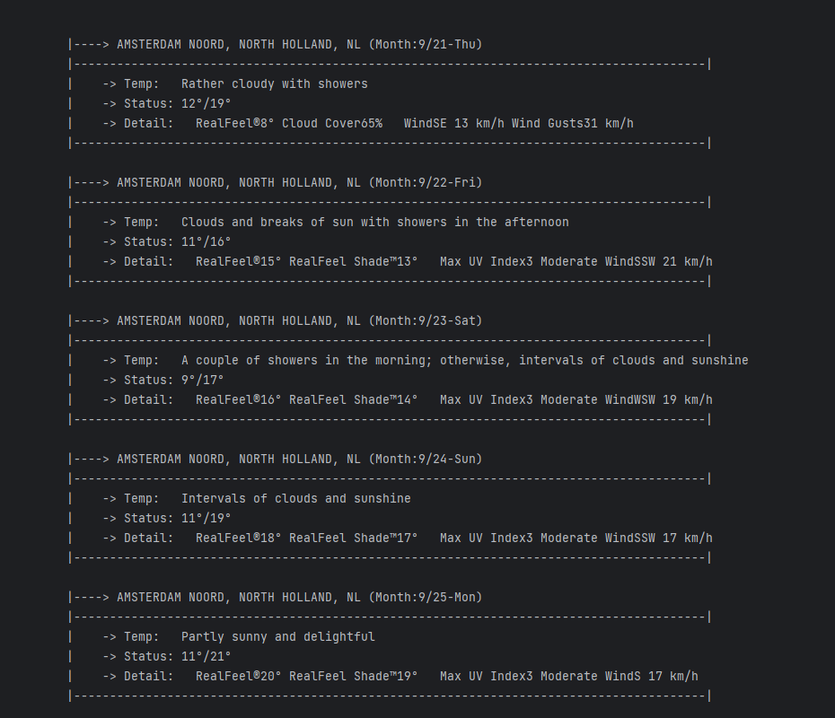

# AeroHarvest
 AeroHarvest is a web crawler project designed to collect and provide weather data.


## Installation

Install The Required Libraries

```bash
   pip install bs4
   pip install requests
```

## Usage/Examples

```python
python weather.py
```


## Screenshots




